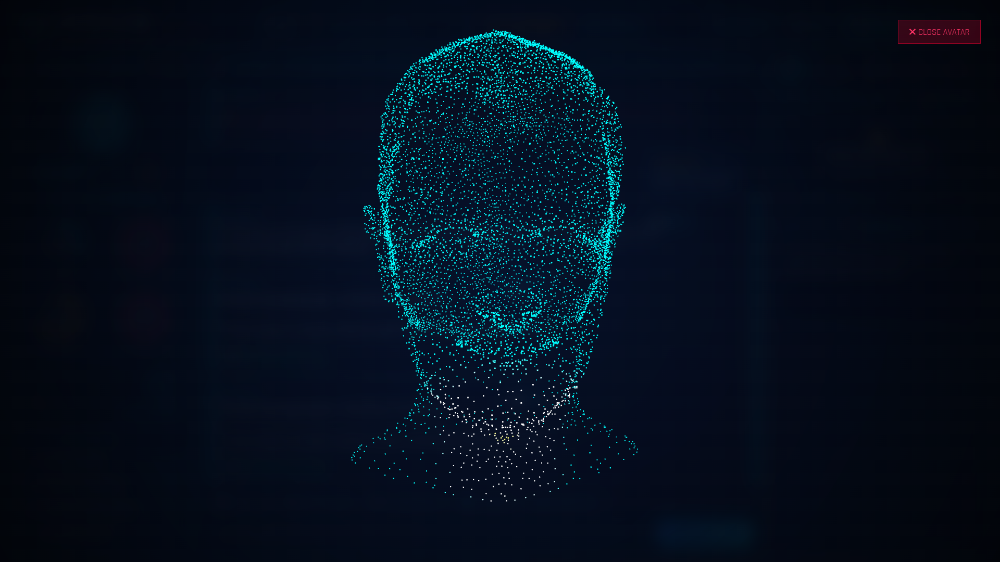

<div align="center">
  
  <br><br>
  
# 🛡️ J.A.R.V.I.S. Personal AI Assistant
### *Just A Rather Very Intelligent System (Mark-86 OS)*

<br>

[](#)
[](#)
[](#)
[](#)
[](#)
[](#)

<br>

*“Sometimes you gotta run before you can walk.”*

</div>

---

## 🌌 Overview

**J.A.R.V.I.S.** is a highly advanced, fully autonomous personal AI desktop companion. Modeled after Tony Stark's iconic cybernetic interface, it is built to bridge the gap between heavy backend neural processing and a stunning futuristic frontend. 

It is capable of thinking locally (via **Ollama**), connecting to the cloud (via **OpenRouter**), synthesizing real-time natural voice (via **Piper/CUDA**), and visually rendering a dynamic **3D Holographic Avatar** that responds to you in real-time.

---

## ⚡ Core Capabilities

<details>
<summary><b>🤖 1. Dynamic 3D Holographic Avatar (Icarus Engine)</b></summary>
<br>
When requested to "show yourself", J.A.R.V.I.S. triggers the <code>AvatarEngine</code>. Over <strong>25,000 glowing WebGL particles</strong> (powered by Three.js) magnetically assemble from scattered powder into a precise 3D human bust. The avatar tracks your mouse movements and features a hot-orange glowing core that seamlessly blends into a cyan aura.
</details>

<details>
<summary><b>🧠 2. Hybrid LLM Routing (Cloud & Local)</b></summary>
<br>
J.A.R.V.I.S. refuses to rely solely on the cloud. The neural engine dynamically routes prompts to <strong>Cloud AI</strong> (e.g., Gemma, Llama-3 via OpenRouter) or falls back to entirely offline <strong>Local AI</strong> (Qwen3.5:4b via Ollama) to ensure 100% uptime and privacy.
</details>

<details>
<summary><b>🗣️ 3. Ultra-Fast Voice Synthesis (TTS)</b></summary>
<br>
Equipped with offline <strong>Piper TTS</strong> running on CUDA (GPU acceleration) and <strong>Microsoft Edge TTS</strong>. J.A.R.V.I.S. fluently speaks both English and Persian (فارسی), synthesizing audio instantly without interrupting the asynchronous data streams.
</details>

<details>
<summary><b>👁️ 4. Vision & OCR Lab</b></summary>
<br>
A built-in Vision Lab allows J.A.R.V.I.S. to take screenshots of your desktop, extract text using Optical Character Recognition, and analyze the contents of your screen instantly.
</details>

<details>
<summary><b>💻 5. Autonomous OS Control</b></summary>
<br>
By utilizing special <code>[[ACTION:...]]</code> neural tags, the AI can autonomously run terminal commands, open applications, fetch system diagnostics (RAM, CPU, GPU), perform web searches, and navigate URLs.
</details>

---

## 🏗️ System Architecture

J.A.R.V.I.S. utilizes a **Client-Server architecture** communicating via WebSockets, HTTP REST APIs, and Server-Sent Events (SSE).

### 🧩 1. The Backend (FastAPI Core)
- **`server.py`**: The central nervous system. A high-performance asynchronous ASGI server that serves the UI, handles REST calls, and multiplexes the SSE streams.
- **`core/llm_engine.py`**: The logic board handling Prompt Engineering. It parses the <code>[[ACTION:xxx]]</code> tags injected by the AI and executes the corresponding OS-level python commands before streaming the text to the UI.
- **`core/tts_engine.py`**: An asynchronous wrapper managing FFMPEG and Piper binaries to rapidly generate `.mp3` and `.wav` audio caches, offloading work to the GPU (`--cuda`).
- **`core/system_tools.py`**: A suite of secure system scripts that give the AI the power to read/write files, launch programs, and manage desktop telemetry.

### 🎨 2. The Frontend (Stark HUD)
- **`index.html`**: A pure vanilla HTML/CSS masterpiece representing the Stark Industries HUD.
- **`js/app.js`**: The main controller handling local storage, UI toggles, Markdown parsing, and live SSE event listening.
- **`js/avatar.js`**: The custom WebGL renderer utilizing `Three.js` and `OBJLoader` to render the 3D particle hologram on a `pointer-events: none` overlay canvas.
- **`js/audio_synth.js`**: Web Audio API integration that queues and plays synthesized voice files perfectly in sync with the LLM output.

---

## 📂 Project Structure

```text
📦 Jarvis
 ┣ 📂 core/                   # Core Backend Modules (Python)
 ┃ ┣ 📜 llm_engine.py         # AI Model routing & Tag execution
 ┃ ┣ 📜 memory_vault.py       # JSON/SQLite persistent memory
 ┃ ┣ 📜 ocr_engine.py         # Computer Vision / Screenshot tools
 ┃ ┣ 📜 protocols.py          # Stark predefined operational protocols
 ┃ ┣ 📜 security.py           # Fernet encryption for API keys
 ┃ ┣ 📜 smart_actions.py      # Web search, URL summarization
 ┃ ┣ 📜 system_tools.py       # Hardware Telemetry & OS integration
 ┃ ┗ 📜 tts_engine.py         # Voice Synthesis generation
 ┣ 📂 static/                 # Frontend Stark HUD (HTML/JS/CSS)
 ┃ ┣ 📂 css/                  # Glowing Neon-Cyan stylesheets
 ┃ ┣ 📂 js/                   # Vanilla JS controllers (avatar, audio)
 ┃ ┣ 📂 models/               # 3D .obj files for the Hologram Avatar
 ┃ ┗ 📜 index.html            # Main UI Entry Point
 ┣ 📜 requirements.txt        # Python Dependencies
 ┣ 📜 run.py                  # Uvicorn Application Launcher
 ┣ 📜 server.py               # FastAPI Endpoints & WebSockets
 ┗ 📜 start_jarvis.bat        # Windows Execution Script
```

---

## 🚀 Quick Start & Installation

### Prerequisites
- Python 3.10+
- An NVIDIA GPU (Recommended for Ollama & Piper CUDA integration)
- `ffmpeg` installed and added to system PATH.

### Installation
1. **Clone the Repository**
   ```bash
   git clone https://github.com/mohammadrezamirtaleb/Jarvis.git
   cd Jarvis
   ```
2. **Create Virtual Environment**
   ```bash
   python -m venv venv
   source venv/Scripts/activate
   ```
3. **Install Dependencies**
   ```bash
   pip install -r requirements.txt
   ```
4. **Boot J.A.R.V.I.S.**
   ```bash
   python run.py
   ```
   *The system will automatically initialize the FastAPI server and launch `http://127.0.0.1:8000` in your default browser.*

---

## 🔐 Security & Privacy
No API keys are hardcoded in this repository. 
Upon booting the interface, you can navigate to the **⚙️ CONFIG** menu in the HUD to enter your API Keys (e.g., OpenRouter). 
These keys are immediately encrypted symmetrically using the `cryptography` library (`core/security.py`) and stored safely in your local `data/memory_vault.json` file. **They will never be exposed or uploaded.**

<br>

<div align="center">
  <b>"For You, Sir, Always."</b>
</div>
