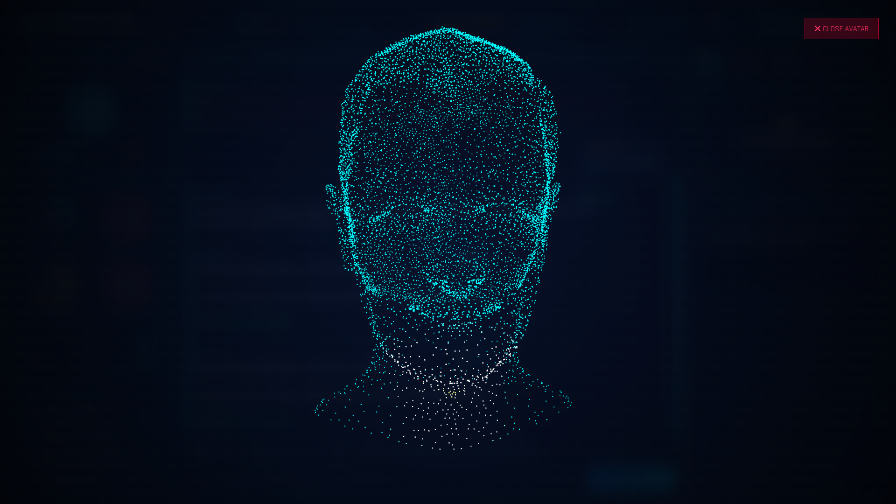

<div align="center">
  
  <br><br>
  
# 🛡️ J.A.R.V.I.S. Mark-86 Desktop
### *Windows 11 Fluent Design Native AI Assistant // Stark Industries*

<br>

[](#)
[](#)
[](#)
[](#)
[](#)

<br>

*“Sometimes you gotta run before you can walk.”*

</div>

---

## 🌌 Overview

**J.A.R.V.I.S. Mark-86** is upgraded from a browser-based tool to a **100% Native Windows 11 Desktop Application** crafted in **Windows 11 Fluent Design (Mica & Acrylic)**.

It features a **Universal Multi-Link Neural Engine** connecting **10 International AI Providers** with intelligent token budgeting and low-token sliding window context optimization.

---

## 🧠 Universal 10 AI Providers

| # | Provider | Target Engine / Flagship Models | Type |
|---|---|---|---|
| 1 | **OpenAI** | GPT-4o, GPT-4o-mini, o1, o3-mini | Cloud // Tier 1 |
| 2 | **Anthropic** | Claude 3.7 Sonnet, Claude 3.5 Sonnet, Claude 3.5 Haiku, Claude 3 Opus | Cloud // Claude |
| 3 | **Google Gemini** | Gemini 2.5 Pro, Gemini 2.5 Flash, Gemini 2.0 Flash Thinking | Cloud // Gemini |
| 4 | **Grok (xAI)** | Grok 2, Grok 2 Vision, Grok Beta | Cloud // xAI |
| 5 | **ZAI (GLM)** | GLM-4-Plus, GLM-4-Flash, GLM-4V | Cloud // GLM |
| 6 | **OpenRouter** | 200+ Free & Paid Cloud Models (Gemma 4, Llama 3.3 70B, etc.) | Cloud // Universal |
| 7 | **Custom Provider** | Connect any custom OpenAI-compatible proxy, LM Studio, LocalAI | Custom // REST |
| 8 | **Ollama** | 100% Offline (Qwen 3.5, Llama 3.3, Mistral, DeepSeek-R1) | Local // Offline |
| 9 | **vLLM** | High-throughput local or cluster GPU inference server | Local/Server // vLLM |
| 10 | **Hugging Face** | Serverless Inference API & TGI endpoints | Cloud // HF Hub |

---

## ⚡ Windows 11 Native Desktop Features

- **Fluent 2 Design & Mica Material**: Frameless desktop window with translucent glass backdrop, rounded corners, and glowing Stark Mark-86 cyan & gold HUD accents.
- **Custom Windows 11 Titlebar**: Integrated with quick provider switching, token limit meters, always-on-top pin (`📌`), and native minimize/maximize/close controls.
- **Left Navigation Rail**: 1-click access to Chat, AI Nexus, Stark Protocols, Vision/OCR Lab, Neural Vault, Hardware Telemetry, Voice Synthesis, and Settings.
- **Token Budget Optimizer**: Low-Token Mode toggle and sliding-window context compression to minimize API token consumption and boost responsiveness.
- **Global Summoning Shortcut**: Summon JARVIS anywhere on Windows by pressing `Ctrl + Shift + J`.
- **System Tray Integration**: Background tray daemon with quick action sweep and diagnostics.
- **3D Holographic Avatar & Arc Reactor**: Three.js WebGL particle avatar and pulsing Arc Reactor core.
- **Edge TTS & Piper Voice**: Natural British & Persian spoken voice output with live waveform visualizer.

---

## 🚀 How to Run Native Desktop

### 1. Quick Launch (Recommended)
Simply double click:
```cmd
start_desktop.bat
```

### 2. Manual Command Line
```powershell
# Install Node and Python dependencies
npm install
pip install -r requirements.txt

# Start Native Windows 11 Desktop Application
npm start
```
